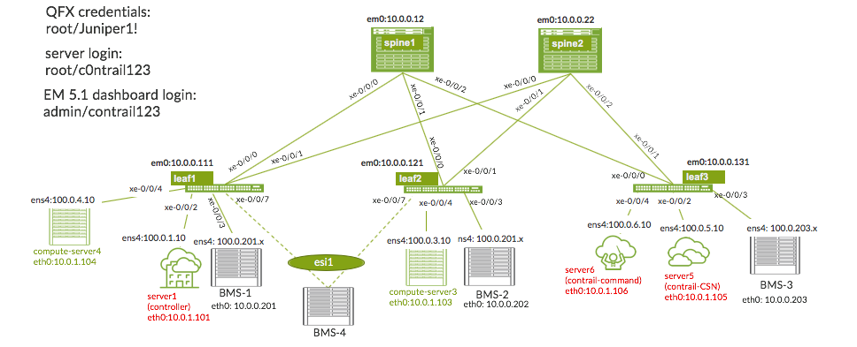
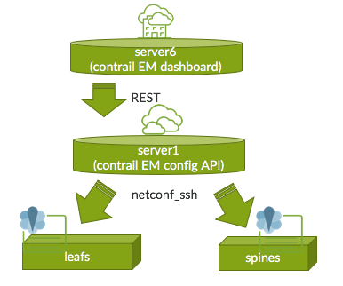

## EVPN-VXLAN - EM 5.1 fabric management hands-on lab

### Lab topology

The following diagram gives an overview of the flows between the EM main dashboard (server6) and the config API (server6 )

### Lab access ###

ravello URL
ravello login info:
username: userX (for example user1, user2 etc given at your desk)
password: Juniper

You can ssh using putty or secure-crt with the dns names or IP@ of the routing-engines RE listed in the table

the lab vqfx device access info: 
`root` and `Juniper1!`

the contrail EM dashboard login/password is:
`admin` and `contrail123`

the servers ssh access login/password is:
`root` and `c0ntrail123`

### Lab objectives

The goal of the present lab is to build the overlay **Edge Routed Bridging** fabric architecture using the Juniper QFX series EVPN-VXLAN technologies in order to deliver L2 active/active forwarding within the datacenter between the BMS servers and VMs. 

The ZTP process was already conducted for the present fabric so the first step is to onboard the devices from the topology and create an overlay iBGP fabric.

The iBGP EVPN sign. overlay will be used in order to advertise the MAC@ and MAC+IP in DC-1 and EVPN-type5 between the DC1 and DC2. 
 
The inter-vni tenant routing will be taking place at the leaf1/leaf2/leaf3 level only i.e. spines should not be provisioned with any tenant information but should play the role of Route Reflectors and IP Forwarders between the leafs

Spine3-re is deployed in DC-2 is connected to the same overlay ASN 64512 and  Spine1-re/Spine2-re but DC-1 to DC-2 exchanges only EVPN type-5 route for prefix-advertisement. 

The ultimate goal of the present lab is to deliver:
 - L2 communication between BMS1 and BMS2 - they should reside in the same virtual-network with VLAN-VNIs allocated dynamically by contrail
 - L3 inter-vni communication should be symmetric and take place only at the leafs 
 - L2 VXLAN gateway for BMS1 to VM2 (on compute-server-3) should allow to communicate between the BMS1 and the VM2 using the same subnet 

The L1-task20 is introducing the **Edge Routed Bridging Overlay** architecture using the IP anycast IRB approach and the inter-POD EVPN route T5. 
### Lab environment

The  environment is composed of the following vqfx nodes: 
- 2 x vQFX Spines - spine1, spine2
- 3 x vQFX Leafs: leaf1, leaf2, leaf3 
- 3 x BMS servers - bm1, bms2, bms3, bms4
- 2 x compute-servers - server3 and server4
- 1 x CSN server -  server5
- 1 x controller - server1
- 1 x EM dashboard - server6

The underlay eBGP is already pre-provisioned in order to deliver full IP reachability between the loopback0.0 IP@ of the given IP fabric 

> All nodes from the lab are accessible via internet, so you can verify each individual node state from your laptop using SSH sessions 

Use the username: `root` and password: `Juniper1!`

### Lab tasks

> **Task 1.0 Verify the full IPv4 underlay reachability within the**  [main topology](https://github.com/juniper-dc/techfest2019#lab-topology)

+ Ensure the full IP reachability of your fabric
+ Verify the eBGP underlay peering are all in the established state

*Expected result:*
+ two eBGP peerings per leaf device in the Established state, 
+ Full IP reachability between the lo0.0 IP addresses of each fabric node

---

> **Task 1.1 Deploy the overlay iBGP EVPN network using the BGP ASN 64512**

+ Discover the devices as based on the given range of subnet 10.0.0.0/24 
+ Associate the devices with the roles 
+ Deploy the overlay

*Expected result:*
+ The leaf and spine devices are discovered and each device is associated with the Edge-Routed architecture roles 
+ Spines1/2 should have role: null (aka Lean Spine) and Route-Reflector 
+ Leafs1/2/3 should have the role: ERB-UCAST-Gateway
---

> **Task 1.2 Verify the iBGP peering is established between all the leafs and spines route reflectors**
+ Using the "show bgp summary” command make sure all leafs have a total of four BGP peerings - two for underlay and two for overlay

*Expected results:*
+ four BGP peerings are in the Established state - two for the underlay and two for the overlay 
---
> **Task 1.3 Enable the new network policy called my_allow_all_policy which will allow for the communication within the BMS1 and BMS2 virtual-network**

+ Go to the Overlay-> Network Policy EM 5.1 dashboard and enable the new network policy that allows the communication from/to network 100.0.201/24 

*Expected result:* The new Network policy is enabled 

---
> **Task 1.4 Enable the Virtual-Network1-2 used for BMS-1 and BMS-2 communication**
+ Go to the Overlay EM 5.1 dashboard and enable new Virtual-Network used for BMS1 and BMS2 in the subnet range 100.0.201.0/24

*Expected result:* The new Virtual-Network is created but not yet pushed to the leaf devices

*Ask yourself:* why the virtual-network is not pushed to the leaf devices in this case ? 

---

> **Task 1.5 Create two VPG-1 and VPG-2 ports: one for BMS1 at leaf1 and one for BMS2 at leaf2 - use the interfaces from the topology diagram**
+ Go to the Overlay -> Virtual-Port-Group option of the EM dashboard and create two VPG ports associated with the virtual-network created in the previous task 

*Expected result:* The virtual-network VLAN and IRB configuration is pushed to the leaf1 and leaf2. 
BMS1 can ping BMS2 and EVPN based MAC@ learning is taking place

*Ask yourself:* 
+ did you have to enable any VNI or VLAN ?
+ are the new virtual-network configurations enabled on all leafs or just selected leafs ?

---
 
> **Task 1.6 Create a new Virtual-network for BMS3**
+ Go to the Overlay EM 5.1 dashboard and enable new Virtual-Network used for BMS3 in the range 100.0.203.0/24

*Expected result:* The new Virtual-Network is not yet pushed to the leaf devices but is successfuly created in the contrail config API

---

> **Task 1.7 Create third VPG-3 ports for BMS3 at leaf3**
+ Go to the Overlay -> Virtual-Port-Group option of the EM dashboard and create two VPG ports associated with the virtual-network created for BMS3 in the previous task

*Expected result:* The virtual-network VLAN and IRB configuration is pushed to the leaf3 only
BMS3 cannot ping the BMS1 and BMS2

---

> **Task 1.8 Create a VPG-4 which will be ready to connect in the future the BMS-4 connected to leaf1 xe-0/0/7 and leaf2 xe-0/0/7**
+ Go to the Overlay -> Virtual-Port-Group option of the EM dashboard and create two VPG ports associated with the same virtual-network as used by BMS-1 and BMS-2

*Expected result:* interfae xe-0/0/7 on leaf1 and leaf2 should be part of a new ESI-LAG, ESI and LACP system-id values of the new ESI-LAG should be allocated automatically by the Fabric Manager

---

> **Task 1.9  Create a new Logical-Router in order to communicate between the BMS1/2 and BMS3 - integrate the BMS1 and BMS3 virtual-networks under the same logical-router**
+ Go to the Overlay -> Logical Router dashboard option and create a new Logical Router name that associates the two Virtual-Networks enabled in previous tasks 
+ Specify at which leaf devices the logical router (T5 instance) should be enabled 

*Expected result:* 
BMS3 is able to ping BMS1/2 
T5 instance is pushed dynamically to BMS1/2/3 
(Currently the leafs are enabled only with additional IRB - all in the global routing table and not in a dedicated T5 instance enabled at ERB leaf1/leaf2/leaf3 

---

> **Task 1.10 Ensure the CSN is onboarded using server5 and services it offers are fully functional**
+ ensure the DHCP daemon is running at the CSN server
+ check what other service are running on that server
*Ask yourself:* 
+ what's the purpose of that server ? 
+ if we were deploying only the BMSes in the fabric do you still need CSN services ? 

---

> **Task 1.11 Onboard the servers server3 and server4 as compute-4 as compute-nodes (aka vrouters)**
+ server4 attached to leaf1 and server2 attached to leaf2 are successfully onboarded

*Expected result:*
+ you can ping from these servers their default gateway
+ ping between server3 and server4
+ ping from server3/server4 to the CSN server works as well using the in-band network

---

> **Task 1.12 Using a Cirros linux image enable the VM-1 on server4 cmpute-node and VM-2 on server3 compute-node**
 + VM-1 and VM-2 should be enabled in the already existing virtual-network dedicated to BMS-1 and BMS-2 
 
 *Expected result:* 
 + BMS1 can ping the VM-2
 + BMS-2 can ping VM-1 

---
 
 > **Task 1.13 Create a VM-3 an associate it with the existing virtual-network, created already for the BMS-3**
 
 *Expected result:* VM-3 can ping the BMS-3

*Ask yourself:* 
+ based on which EVPN routes the VXLAN tunnel from compute-node to the leaf is created

---

### Implementation details: 

+ The fabric discovery network: `10.0.0.0/24` 

+ Overlay iBGP ASN number: `64512`

+ BMS1 and BMS2 virtual network IP@ range: `100.0.201.30-100.0.201.45` subnet mask `/24`

+ BMS3 virtual network IP@ range: `100.0.203.30-100.0.203.45` subnet mask `/24`

+ BMS4 virtual network IP@ range:  `100.0.204.30-100.0.204.45` subnet mask `/24`

+ use the fabric, virtual-network, VPG and LR names that are significant for you as the fabric administrator

### Solution guide for EVPN/VXLAN lab ####

+ here's the URL for the solution guide document [WIP]
+ here's the video player with the solution for different tasks [WIP]